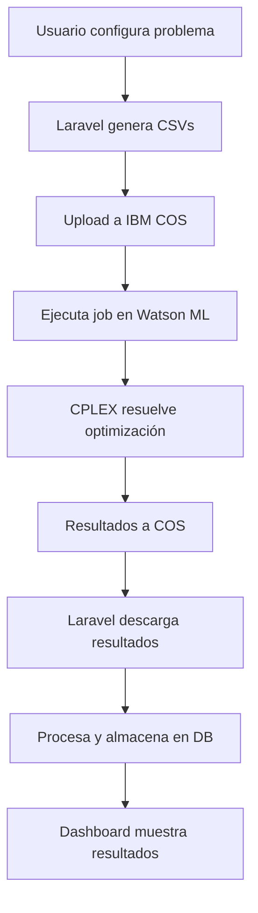

# Capital Budgeting Optimizer

> Sistema de optimización de presupuesto de capital con integración a IBM Cloud para resolver problemas de asignación óptima de recursos financieros.

## 📋 Tabla de Contenidos

- [Descripción](#descripción)
- [Características](#características)
- [Tecnologías](#tecnologías)
- [Arquitectura](#arquitectura)
- [Diagrama de Base de Datos](#diagrama-de-base-de-datos)
- [Instalación](#instalación)
- [Configuración](#configuración)
- [Uso](#uso)
- [API Endpoints](#api-endpoints)
- [Integración IBM Cloud](#integración-ibm-cloud)
- [Flujo de Trabajo](#flujo-de-trabajo)
- [Contribución](#contribución)

## 📖 Descripción

El **Capital Budgeting Optimizer** es una aplicación web que resuelve problemas complejos de asignación de capital financiero utilizando técnicas de optimización matemática. El sistema permite a las empresas tomar decisiones óptimas sobre qué proyectos de inversión ejecutar, cuándo ejecutarlos y cómo maximizar el Valor Presente Neto (VPN) considerando restricciones de liquidez y exclusividad.

### Modelo Matemático

El sistema implementa un modelo de **Programación Lineal Entera Mixta** que maximiza:

```
VPN = Saldo_final / (1 + tasa_descuento)^T - Saldo_inicial
```

### Características del Modelo OPL

El modelo utiliza técnicas avanzadas de **OPL (Optimization Programming Language)** de IBM:

- **Tuplas dinámicas**: Importación flexible desde CSV usando estructuras `tuple`
- **Conjuntos calculados**: Obtención automática de nombres de proyectos
- **Arrays indexados**: Acceso eficiente a costos y recompensas por proyecto/período  
- **Factores de descuento**: Pre-cálculo para optimización de performance
- **Salida estructurada**: Generación automática de tuplas de resultados para integración

**Variables de decisión:**
- `doProj[p][t]`: Binaria - si el proyecto `p` se inicia en período `t`
- `SelectedProj[p][t]`: Binaria - si el proyecto `p` está activo en período `t`
- `Bal[t]`: Continua - saldo de caja al final del período `t`

**Restricciones implementadas:**
- Flujo de caja con intereses compuestos
- Saldos mínimos obligatorios
- Unicidad de selección de proyectos
- Dependencias temporales (proyectos activos post-inicio)
- Exclusividad mutua (must-take-one constraints)

## ✨ Características

### 🎯 Funcionalidades Principales
- **Optimización Matemática**: Utiliza IBM CPLEX para resolver problemas de programación lineal entera mixta
- **Maximización de VPN**: Calcula automáticamente la combinación óptima de proyectos que maximiza el valor presente neto
- **Gestión de Restricciones**: 
  - Saldos mínimos por período
  - Proyectos mutuamente excluyentes
  - Unicidad de selección de proyectos
- **Flexibilidad Temporal**: Soporte para múltiples períodos de planificación
- **Análisis de Sensibilidad**: Evaluación de diferentes escenarios

### 🔧 Características Técnicas
- **Entrada Dinámica**: Configuración mediante archivos CSV editables
- **Procesamiento en la Nube**: Ejecución en IBM Watson Machine Learning
- **Almacenamiento Escalable**: Integración con IBM Cloud Object Storage
- **API REST**: Endpoints para integración con sistemas externos
- **Dashboard Web**: Interfaz intuitiva para usuarios no técnicos
- **Autenticación Segura**: Sistema de usuarios con tokens IBM personalizados

## 🛠 Tecnologías

### Backend
- **Laravel 11** - Framework PHP robusto y escalable
- **PHP 8.3+** - Lenguaje de programación moderno
- **MySQL/PostgreSQL** - Base de datos relacional

### Frontend
- **Laravel Inertia** - SPA sin API usando server-side rendering
- **Vue.js 3** - Framework JavaScript reactivo
- **Tailwind CSS** - Framework CSS utilitario

### Optimización
- **IBM CPLEX** - Solver de optimización matemática
- **OPL (Optimization Programming Language)** - Lenguaje de modelado

### Cloud & Infraestructura
- **IBM Cloud Object Storage (COS)** - Almacenamiento de archivos
- **IBM Watson Machine Learning** - Ejecución de jobs de optimización
- **IBM Identity and Access Management** - Autenticación y autorización

## 🏗 Arquitectura

```
┌─────────────────┐    ┌──────────────────┐    ┌─────────────────────┐
│   Frontend      │    │    Backend       │    │    IBM Cloud       │
│   (Vue.js)      │◄──►│   (Laravel)      │◄──►│                     │
│                 │    │                  │    │  ┌─────────────────┐│
│ • Dashboard     │    │ • API REST       │    │  │ Watson ML       ││
│ • Forms         │    │ • Models         │    │  │ (CPLEX Jobs)    ││
│ • Results       │    │ • Services       │    │  └─────────────────┘│
└─────────────────┘    │ • Controllers    │    │  ┌─────────────────┐│
                       └──────────────────┘    │  │ Cloud Object    ││
                                               │  │ Storage (CSV)   ││
                                               │  └─────────────────┘│
                                               └─────────────────────┘
```

## 📊 Diagrama de Base de Datos


### Descripción de Tablas Principales

- **users**: Gestión de usuarios del sistema
- **optimizations**: Registro de problemas de optimización creados
- **project_inputs**: Costos y recompensas de proyectos por período
- **balance_constraints**: Restricciones de saldo mínimo por período
- **project_groups**: Definición de grupos de proyectos mutuamente excluyentes
- **optimization_results**: Resultados principales de la optimización (VPN, estado, etc.)
- **selected_projects**: Proyectos seleccionados en la solución óptima
- **period_balances**: Evolución de saldos por período
- **period_cash_flows**: Flujos de caja detallados por período

## 🚀 Instalación

### Prerrequisitos
- PHP 8.3+
- Composer
- Node.js 18+
- MySQL/PostgreSQL
- Cuenta de IBM Cloud

### Pasos de Instalación

1. **Clonar el repositorio**
```bash
git clone https://github.com/your-username/capital-budgeting-optimizer.git
cd capital-budgeting-optimizer
```

2. **Instalar dependencias PHP**
```bash
composer install
```

3. **Instalar dependencias JavaScript**
```bash
npm install
```

4. **Configurar entorno**
```bash
cp .env.example .env
php artisan key:generate
```

5. **Configurar base de datos**
```bash
php artisan migrate
php artisan db:seed
```

6. **Compilar assets**
```bash
npm run build
```

## ⚙️ Configuración

### Variables de Entorno

Configura las siguientes variables en tu archivo `.env`:

```env
# Base de datos
DB_CONNECTION=mysql
DB_HOST=127.0.0.1
DB_PORT=3306
DB_DATABASE=capital_budgeting
DB_USERNAME=root
DB_PASSWORD=

# IBM Cloud Object Storage
IBM_COS_API_KEY=your_cos_api_key
IBM_COS_SERVICE_INSTANCE_ID=your_service_instance_id
IBM_COS_ENDPOINT=https://s3.us-south.cloud-object-storage.appdomain.cloud
IBM_COS_BUCKET_NAME=your_bucket_name
IBM_COS_REGION=us-south

# IBM Watson Machine Learning
IBM_WATSON_API_KEY=your_watson_api_key
IBM_WATSON_DEPLOYMENT_ID=your_deployment_id
IBM_WATSON_SPACE_ID=your_space_id
IBM_WATSON_JOB_ID=your_job_id
IBM_WATSON_ENDPOINT=https://api.dataplatform.cloud.ibm.com

# Autenticación IBM
IBM_AUTH_URL=https://iam.cloud.ibm.com/identity/token
```

# Configuración de IBM Cloud

Necesitas configurar varios servicios de IBM Cloud para el funcionamiento completo:

### 1. Cloud Object Storage (COS)
```bash
# Crear instancia de COS
ibmcloud resource service-instance-create capital-budgeting-cos cloud-object-storage lite global

# Crear bucket
ibmcloud cos bucket-create --bucket capital-budgeting-bucket --ibm-service-instance-id <instance-id>

# Generar credenciales
ibmcloud resource service-key-create cos-credentials Manager --instance-name capital-budgeting-cos
```

### 2. Watson Machine Learning  
```bash
# Crear instancia de Watson ML
ibmcloud resource service-instance-create capital-budgeting-ml pm-20 lite us-south

# Crear space para deployments
ibmcloud ml space-create --name "capital-budgeting-space"

### Ejecución de Modelo CPLEX

El archivo `budget_ibm_apto.txt` contiene el modelo OPL que debe ser desplegado en Watson ML:

1. **Preparar modelo**: El archivo OPL está optimizado para CSV dinámicos
2. **Deployment**: Subir a Watson ML y crear job definition  
3. **Ejecución**: Los jobs se ejecutan automáticamente desde Laravel
4. **Monitoreo**: Polling automático del estado hasta completación

El modelo procesa automáticamente los 5 CSVs de entrada y genera 4 CSVs de resultados que son descargados y procesados por la aplicación.

## 📖 Uso

### Dashboard Web

**Páginas principales:**

1. **Inicio** (`/dashboard/inicio`): 
   - Crear nueva optimización
   - Formularios de entrada de datos
   - Configuración de parámetros y proyectos

2. **Historial** (`/dashboard/historial`): 
   - Lista de optimizaciones previas
   - Estados de ejecución (pending, running, completed, failed)
   - Filtros y búsqueda

3. **Resultados** (`/dashboard/resultados`): 
   - Métricas de VPN y ROI
   - Gráficos de flujos de caja
   - Detalles de proyectos seleccionados
   - Análisis de sensibilidad

**Flujo típico:**
1. **Registro/Login**: Crear cuenta de usuario
2. **Configurar Problema**: 
   - Parámetros globales (períodos, tasa de descuento, saldo inicial)
   - Proyectos con costos y recompensas por período
   - Restricciones de balance mínimo
   - Grupos de exclusividad (must-take-one)
3. **Ejecutar**: El sistema automáticamente genera CSVs, los sube a IBM COS y ejecuta el job
4. **Monitorear**: Seguimiento del estado de ejecución en tiempo real
5. **Analizar**: Dashboard con métricas, gráficos y detalles de la solución óptima

### Ejemplo de Entrada

El sistema procesa los siguientes archivos CSV:

**parameters.csv** - Configuración global
```csv
Parameter,Value
T,3
Rate,0.04
InitBal,5000
NbMustTakeOne,1
```

**ProjectCosts.csv** - Costos de implementación
```csv
project,period,cost
Alpha,1,5000
Beta,2,8000
Gamma,1,11000
```

**ProjectRewards.csv** - Recompensas por período
```csv
project,period,reward
Alpha,2,10000
Alpha,3,14000
Beta,3,16000
Gamma,2,22000
Gamma,3,26000
```

**MinBal.csv** - Saldos mínimos requeridos
```csv
Period,MinBal
1,10000
2,15000
3,20000
```

**MustTakeOne.csv** - Grupos de exclusividad
```csv
### Archivos de Salida

El modelo genera automáticamente los siguientes CSVs con resultados:

**SolutionResults.csv** - Resumen ejecutivo
```csv
NPV,FinalBalance,InitialBalance,TotalPeriods,TotalProjects,ProjectsSelected,Status
1500,15000.00,5000,3,3,2,OPTIMAL
```

**SelectedProjectsOutput.csv** - Proyectos seleccionados
```csv
ProjectName,StartPeriod,SetupCost,TotalReward,NPV_Contribution
Alpha,1,5000,24000,19000
Beta,2,8000,16000,8000
```

**BalanceResults.csv** - Evolución de saldos
```csv
Period,Balance,DiscountedBalance
0,5000.00,5000
1,10000.00,9615
2,17000.00,15707
3,25000.00,22204
```

**CashFlowResults.csv** - Flujos de caja
```csv
Period,CashIn,CashOut,NetCashFlow
1,0,5000,-5000
2,10000,8000,2000
3,30000,0,30000
```

## 🔗 API Endpoints

### Optimizaciones

```http
# Crear nueva optimización (flujo completo)
POST /optimizations
Content-Type: application/json

{
  "parameters": {
    "T": 3,
    "Rate": 0.04,
    "InitBal": 5000,
    "NbMustTakeOne": 1,
    "Description": "Optimización Q1 2025"
  },
  "projectCosts": [
    {"project": "Alpha", "period": 1, "cost": 5000},
    {"project": "Beta", "period": 2, "cost": 8000}
  ],
  "projectRewards": [
    {"project": "Alpha", "period": 2, "reward": 10000},
    {"project": "Alpha", "period": 3, "reward": 14000}
  ],
  "minBal": [
    {"Period": 1, "MinBal": 10000},
    {"Period": 2, "MinBal": 15000}
  ],
  "mustTakeOne": [
    {"group": 1, "project": "Alpha"},
    {"group": 1, "project": "Beta"}
  ]
}

# Consultar estado de ejecución
GET /optimizations/{id}/status

# Obtener detalles completos con resultados
GET /optimizations/{id}

# Listar optimizaciones del usuario (con paginación)
GET /optimizations?status=completed&page=1
```

### Rutas Web

```http
# Dashboard principal
GET /dashboard/inicio        # Crear nueva optimización
GET /dashboard/historial     # Historial de optimizaciones  
GET /dashboard/resultados    # Resultados y análisis

# Configuración
GET /settings/profile        # Perfil de usuario
GET /settings/password       # Cambio de contraseña
GET /settings/appearance     # Tema y preferencias
```

### Respuesta de Ejemplo

```json
{
  "success": true,
  "optimization": {
    "id": 1,
    "status": "completed",
    "npv": 1500.00,
    "final_balance": 15000.00,
    "projects_selected": 2,
    "selected_projects": [
      {
        "project_name": "Alpha",
        "start_period": 1,
        "setup_cost": 5000.00,
        "total_reward": 24000.00,
        "npv_contribution": 19000.00
      }
    ]
  }
}
```

## ☁️ Integración IBM Cloud

### Flujo de Datos

1. **Preparación**: Laravel genera archivos CSV con datos de entrada
2. **Upload**: Los CSVs se suben a IBM Cloud Object Storage
3. **Ejecución**: Se dispara job en Watson ML que ejecuta modelo CPLEX
4. **Resultados**: CPLEX genera CSVs de salida en COS
5. **Procesamiento**: Laravel descarga y procesa resultados
6. **Almacenamiento**: Los resultados se guardan en base de datos local

### Servicios Utilizados

- **COS**: Almacenamiento temporal de archivos CSV de entrada y salida
- **Watson ML**: Ejecución de jobs de optimización con CPLEX
- **IAM**: Autenticación y autorización de servicios

## 🔄 Flujo de Trabajo



## 🤝 Contribución

### Desarrollo Local

1. Fork del repositorio
2. Crear rama feature: `git checkout -b feature/nueva-funcionalidad`
3. Commit cambios: `git commit -am 'Agregar nueva funcionalidad'`
4. Push a la rama: `git push origin feature/nueva-funcionalidad`
5. Crear Pull Request

### Estructura del Proyecto

```
app/
├── Http/
│   ├── Controllers/
│   │   ├── OptimizationController.php    # Controlador principal
│   │   ├── Auth/                         # Autenticación
│   │   └── Settings/                     # Configuración usuario
│   ├── Middleware/
│   │   ├── HandleInertiaRequests.php     # Middleware Inertia
│   │   └── HandleAppearance.php          # Tema UI
│   └── Requests/                         # Form requests
├── Models/                               # Modelos Eloquent
│   ├── Optimization.php                  # Modelo principal
│   ├── ProjectInput.php                  # Costos/recompensas
│   ├── OptimizationResult.php            # Resultados
│   └── ...
├── Services/                             # Servicios de negocio
│   ├── CSVGeneratorService.php           # Generación CSVs
│   └── IBM/                              # Integración IBM Cloud
│       ├── IBMAuthService.php            # Autenticación
│       ├── COSService.php                # Object Storage
│       └── WatsonMLService.php           # Machine Learning
config/
├── ibm.php                              # Configuración IBM Cloud
├── inertia.php                          # Configuración Inertia
└── ziggy.php                            # Rutas frontend
database/
├── migrations/                          # Migraciones de BD
└── seeders/                             # Datos de prueba
resources/
├── js/                                  # Frontend Vue.js
│   └── pages/
│       └── dashboard/                   # Páginas del dashboard
└── views/
    └── app.blade.php                    # Layout principal
routes/
├── web.php                              # Rutas principales
├── auth.php                             # Rutas autenticación
└── settings.php                         # Rutas configuración
```

## 📄 Licencia

Este proyecto está bajo la Licencia MIT. Ver `LICENSE` para más detalles.

## 👥 Autores

- **Nicolás Quiroga Santini** - *Frontend & Integration* 
- **Baltasar Ortiz Becerra** - *Backend & Architecture*

## 🆘 Soporte

Para soporte o preguntas:
- Crear issue en GitHub
- Email: [tu-email@ejemplo.com]

---

**Capital Budgeting Optimizer** - Maximizando valor a través de decisiones optimizadas de inversión.
