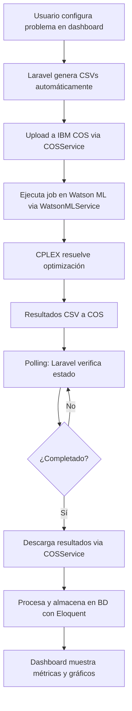

# Capital Budgeting Optimizer

> Sistema de optimización de Capital Budgenting con integración a IBM Cloud para resolver problemas de asignación óptima de recursos financieros. 
**Aclaracion:** esto corresponde a un proyecto grupal universitario correspondiente a la materia Lógica y Optimización Aplicada, la implementacion real de esto no representa la realidad y las pruebas realizadas son puramente ficticias sin un sustento profesional teorico que avale la implementación real del sistema. Capital Budget es un ejemplo de problema intermedio de IBM ILOG CPLEX Optimization Studio que fue adaptado posteriormente para su ejecucion en IBM Cloud.

## Tabla de Contenidos

- [1. Descripción](#1-descripción)
- [2. Características](#2-características)
- [3. Tecnologías](#3-tecnologías)
- [4. Arquitectura](#4-arquitectura)
- [5. Diagrama de Base de Datos](#5-diagrama-de-base-de-datos)
- [6. Instalación](#6-instalación)
- [7. Configuración](#7-configuración)
- [8. Uso](#8-uso)
- [9. API Endpoints](#9-api-endpoints)
- [10. Integración IBM Cloud](#10-integración-ibm-cloud)
- [11. Flujo de Trabajo](#11-flujo-de-trabajo)
- [12. Contribución](#12-contribución)

## 1. Descripción

El **Capital Budgeting Optimizer** es una aplicación web que resuelve problemas complejos de asignación de capital financiero utilizando técnicas de optimización matemática. El sistema permite a las empresas tomar decisiones óptimas sobre qué proyectos de inversión ejecutar, cuándo ejecutarlos y cómo maximizar el Valor Presente Neto (VPN) considerando restricciones de liquidez y exclusividad.

### 1.1 Modelo Matemático

El sistema implementa un modelo de **Programación Lineal Entera Mixta** que maximiza:

```
VPN = Saldo_final / (1 + tasa_descuento)^T - Saldo_inicial
```

### 1.2 Características del Modelo OPL

El modelo utiliza técnicas avanzadas de **OPL (Optimization Programming Language)** de IBM:

- **Tuplas dinámicas**: Importación flexible desde CSV usando estructuras `tuple`
- **Conjuntos calculados**: Obtención automática de nombres de proyectos
- **Arrays indexados**: Acceso eficiente a costos y recompensas por proyecto/período  
- **Factores de descuento**: Pre-cálculo para optimización de performance
- **Salida estructurada**: Generación automática de tuplas de resultados para integración

**Variables de decisión:**
- `doProj[p][t]`: Binaria - si el proyecto `p` se inicia en período `t`
- `SelectedProj[p][t]`: Binaria - si el proyecto `p` está activo en período `t`
- `Bal[t]`: Continua - saldo de caja al final del período `t`

**Restricciones implementadas:**
- Flujo de caja con intereses compuestos
- Saldos mínimos obligatorios
- Unicidad de selección de proyectos
- Dependencias temporales (proyectos activos post-inicio)
- Exclusividad mutua (must-take-one constraints)

## 2. Características

### 2.1 Funcionalidades Principales
- **Optimización Matemática**: Utiliza IBM CPLEX para resolver problemas de programación lineal entera mixta
- **Maximización de VPN**: Calcula automáticamente la combinación óptima de proyectos que maximiza el valor presente neto
- **Dashboard Interactivo**: Interfaz web moderna con 3 páginas principales:
  - **Inicio**: Configuración y creación de nuevas optimizaciones
  - **Historial**: Seguimiento de optimizaciones previas con paginación
  - **Resultados**: Visualización de métricas, gráficos y análisis detallados
- **Métricas Avanzadas**: Dashboard de métricas con gráficos interactivos (LineChart, BarChart)
- **Gestión de Restricciones**: 
  - Saldos mínimos por período
  - Proyectos mutuamente excluyentes
  - Unicidad de selección de proyectos
- **Flexibilidad Temporal**: Soporte para múltiples períodos de planificación
- **Monitoreo en Tiempo Real**: Seguimiento del estado de ejecución con polling automático

### 2.2 Características Técnicas
- **Entrada Dinámica**: Configuración mediante formularios web interactivos
- **Procesamiento en la Nube**: Ejecución automática en IBM Watson Machine Learning
- **Almacenamiento Escalable**: Integración completa con IBM Cloud Object Storage
- **API REST**: Endpoints completos para integración con sistemas externos
- **Autenticación Segura**: Sistema de usuarios con tokens IBM personalizados y middleware
- **Generación Automática de CSV**: Servicio dedicado para crear archivos de entrada dinámicos
- **Análisis Visual**: Gráficos de flujo de caja, evolución de saldos y contribución de proyectos

## 3. Tecnologías

### 3.1 Backend
- **Laravel 12** - Framework PHP robusto y escalable
- **PHP 8.3+** - Lenguaje de programación moderno
- **MySQL/PostgreSQL** - Base de datos relacional
- **Eloquent ORM** - Mapeo objeto-relacional

### 3.2 Frontend
- **Laravel Inertia** - SPA sin API usando server-side rendering
- **Vue.js 3** - Framework JavaScript reactivo con Composition API
- **Tailwind CSS** - Framework CSS utilitario
- **Recharts** - Librería de gráficos para visualización de datos
- **Shadcn/ui** - Componentes de UI modernos

### 3.3 Optimización
- **IBM CPLEX** - Solver de optimización matemática
- **OPL (Optimization Programming Language)** - Lenguaje de modelado

### 3.4 Cloud & Infraestructura
- **IBM Cloud Object Storage (COS)** - Almacenamiento de archivos
- **IBM Watson Machine Learning** - Ejecución de jobs de optimización
- **IBM Identity and Access Management** - Autenticación y autorización

## 4. Arquitectura

```
┌─────────────────┐    ┌──────────────────┐    ┌─────────────────────┐
│   Frontend      │    │    Backend       │    │    IBM Cloud       │
│   (Vue.js)      │◄──►│   (Laravel)      │◄──►│                     │
│                 │    │                  │    │  ┌─────────────────┐│
│ • Dashboard     │    │ • API REST       │    │  │ Watson ML       ││
│ • Inicio        │    │ • Models         │    │  │ (CPLEX Jobs)    ││
│ • Historial     │    │ • Services       │    │  └─────────────────┘│
│ • Resultados    │    │ • Controllers    │    │  ┌─────────────────┐│
│ • Métricas      │    │ • Middleware     │    │  │ Cloud Object    ││
└─────────────────┘    └──────────────────┘    │  │ Storage (CSV)   ││
                                               │  └─────────────────┘│
                                               └─────────────────────┘
```

## 5. Diagrama de Base de Datos


### 5.1 Descripción de Tablas Principales

- **users**: Gestión de usuarios del sistema con tokens IBM
- **optimizations**: Registro de problemas de optimización creados
- **project_inputs**: Costos y recompensas de proyectos por período
- **balance_constraints**: Restricciones de saldo mínimo por período
- **project_groups**: Definición de grupos de proyectos mutuamente excluyentes
- **optimization_results**: Resultados principales de la optimización (VPN, estado, etc.)
- **selected_projects**: Proyectos seleccionados en la solución óptima
- **period_balances**: Evolución de saldos por período
- **period_cash_flows**: Flujos de caja detallados por período

## 6. Instalación

### 6.1 Prerrequisitos
- PHP 8.3+
- Composer
- Node.js 18+
- MySQL/PostgreSQL
- Cuenta de IBM Cloud con servicios COS y Watson ML configurados

### 6.2 Pasos de Instalación

1. **Clonar el repositorio**
```bash
git clone https://github.com/your-username/capital-budgeting-optimizer.git
cd capital-budgeting-optimizer
```

2. **Instalar dependencias PHP**
```bash
composer install
```

3. **Instalar dependencias JavaScript**
```bash
npm install
```

4. **Configurar entorno**
```bash
cp .env.example .env
php artisan key:generate
```

5. **Configurar base de datos y variables de entorno**
```bash
# Editar .env con configuración de BD e IBM Cloud
nano .env
```

6. **Ejecutar migraciones**
```bash
php artisan migrate
php artisan db:seed
```

7. **Compilar assets**
```bash
npm run build
# O para desarrollo:
npm run dev
```

8. **Levantar servidor**
```bash
php artisan serve
```

## 7. Configuración

### 7.1 Variables de Entorno

Configura las siguientes variables en tu archivo `.env`:

```env
# Base de datos
DB_CONNECTION=mysql
DB_HOST=127.0.0.1
DB_PORT=3306
DB_DATABASE=capital_budgeting
DB_USERNAME=root
DB_PASSWORD=

# IBM Cloud Object Storage
IBM_COS_API_KEY=your_cos_api_key
IBM_COS_SERVICE_INSTANCE_ID=your_service_instance_id
IBM_COS_ENDPOINT=https://s3.us-south.cloud-object-storage.appdomain.cloud
IBM_COS_BUCKET_NAME=your_bucket_name
IBM_COS_REGION=us-south

# IBM Watson Machine Learning
IBM_WATSON_API_KEY=your_watson_api_key
IBM_WATSON_DEPLOYMENT_ID=your_deployment_id
IBM_WATSON_SPACE_ID=your_space_id
IBM_WATSON_JOB_ID=your_job_id
IBM_WATSON_ENDPOINT=https://api.dataplatform.cloud.ibm.com

# Autenticación IBM
IBM_AUTH_URL=https://iam.cloud.ibm.com/identity/token
```

### 7.2 Ejecución de Modelo CPLEX

El archivo `budget_ibm_apto.txt` contiene el modelo OPL que debe ser desplegado en Watson ML:

1. **Preparar modelo**: El archivo OPL está optimizado para CSV dinámicos
2. **Deployment**: Subir a Watson ML y crear job definition  
3. **Ejecución**: Los jobs se ejecutan automáticamente desde Laravel
4. **Monitoreo**: Polling automático del estado hasta completación

El modelo procesa automáticamente los 5 CSVs de entrada y genera 4 CSVs de resultados que son descargados y procesados por la aplicación.

## 8. Uso

### 8.1 Dashboard Web

**Páginas principales:**

1. **Inicio** (`/dashboard/inicio`): 
   - Crear nueva optimización
   - Formulario de configuración paso a paso
   - Gestión dinámica de proyectos
   - Configuración de parámetros globales (períodos, tasa de descuento, saldo inicial)
   - Definición de grupos de exclusividad (must-take-one)
   - Configuración de saldos mínimos por período
   - Tablas editables de costos y recompensas por proyecto

2. **Historial** (`/dashboard/historial`): 
   - Lista paginada de optimizaciones previas
   - Estados de ejecución (pending, running, completed, failed)
   - Filtros por estado y fecha
   - Acceso rápido a resultados

3. **Resultados** (`/dashboard/resultados`): 
   - Métricas principales: VPN, saldo final, proyectos seleccionados
   - Dashboard de métricas con gráficos interactivos
   - Tabla detallada de proyectos seleccionados
   - Flujos de caja por período
   - Evolución de saldos
   - Monitoreo en tiempo real para optimizaciones en curso

### 8.2 Flujo típico
1. **Registro/Login**: Crear cuenta de usuario
2. **Configurar Problema**: 
   - Parámetros globales (períodos, tasa de descuento, saldo inicial)
   - Gestión de proyectos con costos y recompensas base
   - Configuración de grupos de exclusividad
   - Definición de saldos mínimos por período
   - Ajuste fino de costos y recompensas por período
3. **Ejecutar**: El sistema automáticamente genera CSVs, los sube a IBM COS y ejecuta el job
4. **Monitorear**: Seguimiento del estado de ejecución en tiempo real con mensajes rotativos
5. **Analizar**: Dashboard completo con métricas, gráficos y detalles de la solución óptima

### 8.3 Ejemplo de Entrada

El sistema procesa los siguientes archivos CSV generados automáticamente:

**parameters.csv** - Configuración global
```csv
Parameter,Value
T,3
Rate,0.04
InitBal,5000
NbMustTakeOne,1
```

**ProjectCosts.csv** - Costos de implementación
```csv
project,period,cost
IBM_5500,1,4000
Sun_2000,2,4500
New_CFO,1,8000
```

**ProjectRewards.csv** - Recompensas por período
```csv
project,period,reward
IBM_5500,2,2000
IBM_5500,3,2000
Sun_2000,3,2500
New_CFO,2,2000
New_CFO,3,2000
```

**MinBal.csv** - Saldos mínimos requeridos
```csv
Period,MinBal
1,0
2,0
3,0
```

**MustTakeOne.csv** - Grupos de exclusividad
```csv
group,project
1,IBM_5500
1,Sun_2000
```

### 8.4 Archivos de Salida

El modelo genera automáticamente los siguientes CSVs con resultados:

**SolutionResults.csv** - Resumen ejecutivo
```csv
NPV,FinalBalance,InitialBalance,TotalPeriods,TotalProjects,ProjectsSelected,Status
1958,14150.85,5000,3,5,2,OPTIMAL
```

**SelectedProjectsOutput.csv** - Proyectos seleccionados
```csv
ProjectName,StartPeriod,SetupCost,TotalReward,NPV_Contribution
IBM_5500,1,4000,4000,0
New_CFO,1,8000,4000,-4000
```

**BalanceResults.csv** - Evolución de saldos
```csv
Period,Balance,DiscountedBalance
0,5000,5000
1,7200,6923
2,9488,8769
3,14150,12581
```

**CashFlowResults.csv** - Flujos de caja
```csv
Period,CashIn,CashOut,NetCashFlow
1,0,12000,-12000
2,4000,0,4000
3,4000,0,4000
```

## 9. API Endpoints

### 9.1 Optimizaciones

```http
# Crear nueva optimización (flujo completo)
POST /optimizations
Content-Type: application/json

{
  "parameters": {
    "T": 3,
    "Rate": 0.04,
    "InitBal": 5000,
    "NbMustTakeOne": 1,
    "Description": "Optimización Q1 2025"
  },
  "projectCosts": [
    {"project": "IBM_5500", "period": 1, "cost": 4000},
    {"project": "Sun_2000", "period": 2, "cost": 4500}
  ],
  "projectRewards": [
    {"project": "IBM_5500", "period": 2, "reward": 2000},
    {"project": "IBM_5500", "period": 3, "reward": 2000}
  ],
  "minBal": [
    {"Period": 1, "MinBal": 0},
    {"Period": 2, "MinBal": 0},
    {"Period": 3, "MinBal": 0}
  ],
  "mustTakeOne": [
    {"group": 1, "project": "IBM_5500"},
    {"group": 1, "project": "Sun_2000"}
  ]
}

# Consultar estado de ejecución
GET /optimizations/{id}/status

# Listar optimizaciones del usuario (con paginación)
GET /optimizations
```

### 9.2 Rutas Web

```http
# Dashboard principal
GET /dashboard                   # Redirige a inicio
GET /dashboard/inicio           # Crear nueva optimización
GET /dashboard/historial        # Historial de optimizaciones  
GET /dashboard/resultados       # Resultados y análisis

# Configuración de usuario
GET /settings/profile           # Perfil de usuario
GET /settings/password          # Cambio de contraseña
GET /settings/appearance        # Tema y preferencias
```

### 9.3 Respuesta de Ejemplo

```json
{
  "success": true,
  "status": "completed",
  "optimization": {
    "id": 1,
    "description": "Optimización Q1 2025",
    "status": "completed",
    "total_periods": 3,
    "discount_rate": 0.04,
    "initial_balance": 5000,
    "nb_must_take_one": 1,
    "result": {
      "npv": 1958.00,
      "final_balance": 14150.85,
      "projects_selected": 2,
      "status": "OPTIMAL"
    },
    "selected_projects": [
      {
        "project_name": "IBM_5500",
        "start_period": 1,
        "setup_cost": 4000.00,
        "total_reward": 4000.00,
        "npv_contribution": 0.00
      }
    ]
  }
}
```

## 10. Integración IBM Cloud

### 10.1 Flujo de Datos

1. **Preparación**: Laravel genera archivos CSV con datos de entrada usando CSVGeneratorService
2. **Upload**: Los CSVs se suben a IBM Cloud Object Storage via COSService
3. **Ejecución**: Se dispara job en Watson ML que ejecuta modelo CPLEX via WatsonMLService
4. **Monitoreo**: Polling automático del estado con mensajes en tiempo real
5. **Resultados**: CPLEX genera CSVs de salida en COS automáticamente
6. **Procesamiento**: Laravel descarga y procesa resultados usando COSService
7. **Almacenamiento**: Los resultados se guardan en base de datos local con modelos Eloquent

### 10.2 Servicios Utilizados

- **COS**: Almacenamiento temporal de archivos CSV de entrada y salida
- **Watson ML**: Ejecución de jobs de optimización con CPLEX
- **IAM**: Autenticación y autorización de servicios con tokens por usuario

### 10.3 Arquitectura de Servicios

```php
// Servicios principales implementados
App\Services\IBM\IBMAuthService     // Gestión de tokens IBM
App\Services\IBM\COSService         // Operaciones con Object Storage  
App\Services\IBM\WatsonMLService    // Ejecución y monitoreo de jobs
App\Services\CSVGeneratorService    // Generación dinámica de CSVs
```

## 11. Flujo de Trabajo



## 12. Contribución

### 12.1 Desarrollo Local

1. Fork del repositorio
2. Crear rama feature: `git checkout -b feature/nueva-funcionalidad`
3. Commit cambios: `git commit -am 'Agregar nueva funcionalidad'`
4. Push a la rama: `git push origin feature/nueva-funcionalidad`
5. Crear Pull Request

### 12.2 Estructura del Proyecto

```
app/
├── Http/
│   ├── Controllers/
│   │   ├── OptimizationController.php    # Controlador principal
│   │   ├── Auth/                         # Autenticación
│   │   └── Settings/                     # Configuración usuario
│   ├── Middleware/
│   │   ├── HandleInertiaRequests.php     # Middleware Inertia
│   │   └── HandleAppearance.php          # Tema UI
│   ├── Requests/                         # Form requests
│   └── Resources/
│       └── OptimizationResource.php     # API Resources
├── Models/                               # Modelos Eloquent
│   ├── Optimization.php                  # Modelo principal
│   ├── ProjectInput.php                  # Costos/recompensas
│   ├── OptimizationResult.php            # Resultados
│   ├── SelectedProject.php               # Proyectos seleccionados
│   ├── PeriodBalance.php                 # Saldos por período
│   ├── PeriodCashFlow.php                # Flujos de caja
│   └── ...
├── Services/                             # Servicios de negocio
│   ├── CSVGeneratorService.php           # Generación CSVs
│   └── IBM/                              # Integración IBM Cloud
│       ├── IBMAuthService.php            # Autenticación
│       ├── COSService.php                # Object Storage
│       └── WatsonMLService.php           # Machine Learning
config/
├── ibm.php                              # Configuración IBM Cloud
├── inertia.php                          # Configuración Inertia
└── ziggy.php                            # Rutas frontend
database/
├── migrations/                          # Migraciones de BD
└── seeders/                             # Datos de prueba
resources/
├── js/                                  # Frontend Vue.js
│   ├── components/
│   │   └── metrics/
│   │       ├── MetricsDashboard.vue     # Dashboard de métricas
│   │       └── charts/                  # Componentes de gráficos
│   └── pages/
│       └── dashboard/                   # Páginas del dashboard
│           ├── Inicio.vue               # Configuración
│           ├── Historial.vue            # Lista de optimizaciones
│           └── Resultados.vue           # Visualización de resultados
└── views/
    └── app.blade.php                    # Layout principal
routes/
├── web.php                              # Rutas principales
├── auth.php                             # Rutas autenticación
└── settings.php                         # Rutas configuración
```

## 13. Licencia

Este proyecto está bajo la Licencia MIT. Ver `LICENSE` para más detalles.

## 14. Autores

- **Nicolás Quiroga Santini**
- **Baltasar Ortiz Becerra**

## 15. Soporte

Para soporte o preguntas:
- Crear issue en GitHub

---

**Capital Budgeting Optimizer** - Maximizando valor a través de decisiones optimizadas de inversión.
